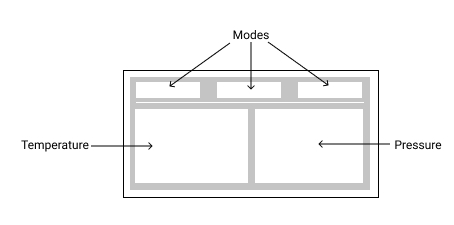

> [Back to main page](../README.md)

# Design document
The purpose of this document is:
- To outline what functionality the PID, "koffie," has
- How "koffie" behaves when iteracted with by a human
- How "koffie" interacts with an espresso machine

## Program modes
1. Espresso - low pressure for extracting espresso
1. Milk - high pressure for frothing milk
1. Manual - "on the fly" pressure adjustment
1. Programming - overwrite the default pressure levels with custom values

## Controls
- 2 momentary buttons which are used to set and access stored values
    - Button 1:
        - **Momentary press:**
            1. deactivate current program
            1. activate "Espresso Mode" & call-up pressure for extracting espresso
        - **Long press:**
            - See [Progamming Mode](../README.md#programming-mode)
    - Button 2:
        - **Momentary press:** 
            1. deactivate current program
            1. activate "Milk Mode" & call-up pressure for frothing milk
        - **Long press:**
            - See [Progamming Mode](../README.md#programming-mode)
- 1 multi-function rotary encoder
    - If in Espresso or Milk modes:
        - deactivate current program
        - activate "Manual Mode," and enable on-the-fly boiler pressure adjustment
    
## GUI
### Block diagram of interface

### Populated block diagram interface
|  |  |
| - | - |
|  | - A single mode is illuminated when activated   - When in "programming mode," the corresponding parent mode will flash   - Temperatures are displayed, if available   - if no probe is connected, `N/C` is displayed |
