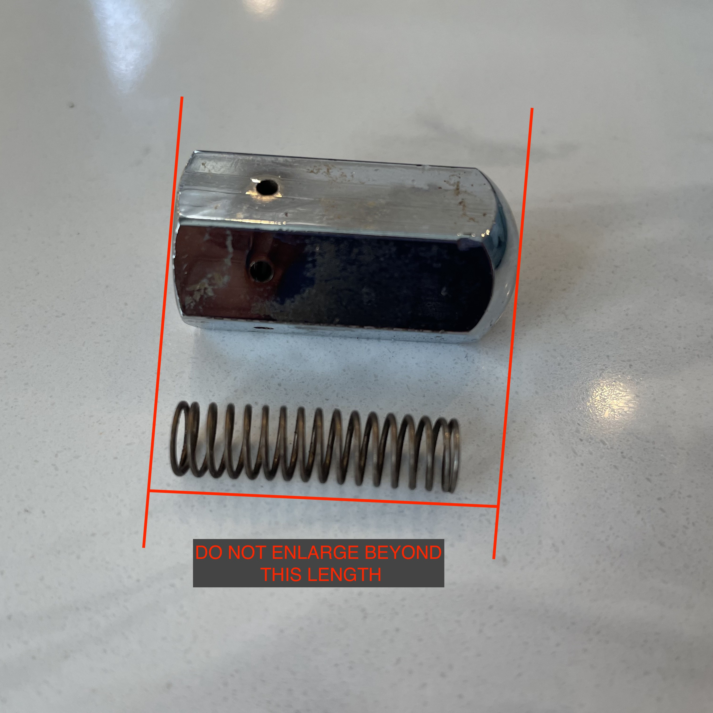

> [Back to main page](../../README.md)

# Europiccola

## Wiring
- Simply wire the relay's switched voltage (mains) between the thermocouple (thermal fuse) and the power switch.

## Modifying the pressure
> ⚠️ This is exceptionally dangerous! Only do so at your own risk! ⚠️

### Mechanical Pressure Valve
Should you want more pressure from your boiler, do the following:
- Dissasemble the mechanical pressure valve and slightly pull on the spring. By stretching it out, you increase the pressure placed on the ball bearing, which will increase the amount of pressure required to actuate the valve. This increases the overall boiler pressure.
- Make small adjustments, then bring the machine up to temperature and check at what pressure the valve opens. Re-adjust as necessary.
- **DO NOT TAKE THE PRESSURE ABOVE 1.5 BAR!** That is unsafe, and there is no need to brew espesso/froth milk at pressures above 1.3 BAR.
    
    - image credit: Robert McKeon Aloe
    - [https://towardsdatascience.com/increasing-the-pressure-for-la-pavoni-espresso-2a8ee0febb1e](https://towardsdatascience.com/increasing-the-pressure-for-la-pavoni-espresso-2a8ee0febb1e)

### Pressurestat Models
- https://www.google.com/search?q=europiccola+pressurestat+increase+pressure
